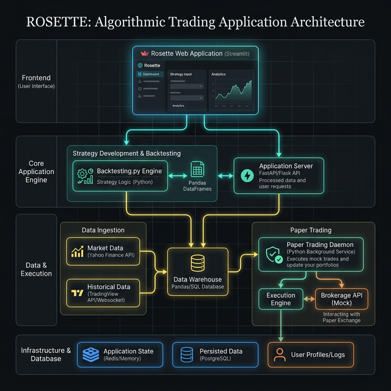

# Rosette 🌌 | Algorithmic Trading Workspace

A comprehensive Python-based workspace designed to quickly fetch historical market data, easily write diverse trading strategies, and execute lightning-fast backtests with a rich graphical user interface.

## 🚀 Features

* **Historical Data Fetching**: Seamlessly connect to and download daily/intraday bars directly from TradingView without needing login tokens using `tvDatafeed`.
* **Integrated Streamlit UI**: A clean, single-page web dashboard (`app.py`) to manage your data, strategies, and test results.
* **Strategy Editor**: Build custom Python functions extending `backtesting.Strategy` directly in your browser.
* **Execution Override**: Use the advanced UI block to dynamically test parameters and change strategy conditions on-the-fly (`bt.optimize()`).
* **Date Slicing**: Automatically detect Date columns in your data and slice the execution to specific timeframes natively in the UI.
* **Result Comparison**: Natively compare and visually analyze saved historical runs side-by-side.
* **Interactive Charting**: Implements interactive `Bokeh` web charts overlaid with your trades, returns, indicators, and volume straight in the browser.
* **Live Paper Trading**: Spawn decoupled background daemons (`paper_engine.py`) to run your strategies natively on live-updating tickers without locking your Streamlit dashboard.
* **Benchmark Alpha Comparison**: Automatically overlays your Strategy Equity curve against a persistent Daily Nifty 50 Buy-and-Hold baseline to visualize true outperformance.
* **Timeframe Resampling**: Convert granular (e.g. 5-minute) datasets into higher timeframes (`15T`, `30T`, `1H`, `4H`, `1D`) on-the-fly in Backtesting, Bulk Testing, and Optimization tabs.
* **Execution Scale Estimation**: Live calculation and display of the projected count of backtests to run in Bulk Testing (broken down per dataset) to help prevent long execution hangs.

## 🏗️ System Architecture



## 🧰 Core Dependencies & Engine

Rosette is built on a highly optimized, modern Python stack:
- **[Streamlit](https://streamlit.io/)**: Powers the entire reactive frontend UI, dashboard, and parameter grids.
- **[Backtesting.py](https://kernc.github.io/backtesting.py/)**: The core execution engine. It provides the `Strategy` classes and ultra-fast vectorized backtesting logic that powers every historical run inside Tab 3 and Tab 5.
- **[tvDatafeed](https://github.com/rongardF/tvdatafeed)**: Bypasses broker APIs to natively download highly accurate intraday/daily bars directly from TradingView.
- **[Bokeh](https://bokeh.org/)**: The underlying visualization library used by `backtesting.py` to render the interactive HTML charts.
- **[Pandas](https://pandas.pydata.org/)**: Used extensively for heavy dataframe manipulation, time-series masking, and data re-indexing.

## 📁 Project Structure

```text
e:\AI\Trade\Rosette\
├── app.py                # Main Streamlit Dashboard Application
├── fetch_data.py         # Standalone logic used to connect and pull TVData 
├── test_backtest.py      # A small functional test to verify dependencies 
├── assets/               # Image assets for the Rosette UI
├── data/                 # Store all fetched historical ticker `.csv` datasets
├── strategies/           # Directory where your custom `.py` strategies are saved
├── results/              # Directory where execution stats and HTML charts are automatically exported
└── refernce/             # User's provided reference codes & Jupyter notebooks (Do Not Delete)
```

## 💻 Getting Started

### 1. Requirements

Ensure you have the required libraries installed in your Python environment. You can install everything you need using the system terminal.
```bash
pip install streamlit streamlit-ace backtesting pandas bokeh git+https://github.com/rongardF/tvdatafeed.git
```

### 2. Launch the Application

The entire workflow is driven via the browser dashboard. Once your environment is active, start the Streamlit server using python:

```bash
cd e:\AI\Trade\Rosette
python -m streamlit run app.py
```

### 3. Usage Guide

1. **Fetch Data (`Tab 1`)**: Open the UI. Specify your target Symbol (e.g. `SBIN`), Exchange (`NSE`), Interval, and depth. This will download a `.csv` file into the `data/` folder.
2. **Strategy IDE Editor (`Tab 2`)**: Write your strategy using the integrated full-featured IDE (syntax highlighting, Vim/Emacs keybindings, adjustable font size, and visual themes).
   - **Interactive Diagnostics**: Click "Compile & Test Strategy" to verify your code against syntax errors, validate subclass structure, and simulate a 200-day execution dry-run to identify runtime issues before saving.
3. **Run Backtest (`Tab 3`)**: Mix and match any Dataset with any Strategy. 
   - **Date Slicer**: If a dataset has valid timestamps, a calendar view will appear allowing you to trim the backtest to a specific period.
   - **Timeframe Resampling**: Dynamically resample granular data to a higher timeframe (`15 Min`, `1 Hour`, `1 Day`, etc.) prior to backtest execution.
   - **Configure Parameters**: Expand the settings to simulate leverage (`Margin`), capital (`Initial Cash`), spreads, commission sizing, and order locking.
   - **Execution Script Override**: Manually edit the final backtest execution code block inside a matching integrated Streamlit Ace editor. A global configuration synchronizes your IDE settings (theme, bindings, word wrap) across all tabs automatically.
4. **Compare Results (`Tab 4`)**: Review your saved historical executions.
   - Select multiple past runs using the multi-selector to view their performance metrics side-by-side in a comparative table.
   - Select an individual run to render its saved interactive HTML chart natively within the dashboard.
5. **Bulk Testing (`Tab 5`)**: Automatically evaluate a strategy across hundreds of discrete timeframes or candle intervals.
   - **Capability**: Fights overfitting by segmenting your data into time chunks.
   - Use the **DateTime Mask** to precisely limit the dataset, then select a grouping rule (`Daily`, `Weekly`, `Monthly`, `Intraday Time Windows`, or `Resample Timeframes`).
   - **Scale Estimation**: View the live projected test count and per-dataset breakdown before starting, along with warning notices for high execution scales (>100 runs).
   - The engine automatically isolates the data, runs an independent backtest on each slice, and ranks the most profitable slices in a unified matrix.
   - Final matrices are automatically saved explicitly to the `bulk_results/` directory.
6. **Optimize Parameters (`Tab 6`)**: Automatically dial in your strategy variables.
   - Select a Strategy, and the engine detects its variables (e.g., SMA periods). Set `Min`, `Max`, and `Step` ranges for each configuration.
   - Restrict your optimization to localized timeframes using the embedded **DateTime Mask**.
   - Choose between **Grid Search (Brute Force)** to systematically test every single combination, or **SMBO (Machine Learning via scikit-optimize/sambo)** to intelligently dial-in variables extremely fast.
   - Winning parameters, grids, and rendering charts are saved to an isolated `opt_results/` directory to prevent clogging your normal backtest results folder.
7. **Paper Trading Engine (`Tab 7`)**: Test your algorithms in real-time.
   - Select a Live Data Source (`TradingView` or `Yahoo Finance`), your ticker, and your Strategy.
   - The UI spawns a powerful, decoupled Python `subprocess` that runs in the background exactly like a live crypto/stock trading bot. It automatically fetches new bars based on your Delay setting.
   - The **Active Engines Dashboard** parses the background JSON state, presenting you with your Live Net Equity, Open Positions, and an auto-updating Interactive Plot!
8. **Monte Carlo Analysis (`Tab 8`)**: Stress-test your strategy by simulating thousands of different trade sequences.
   - Select a previously run backtest's trade ledger to analyze sequence risk.
   - Configure the number of simulations, starting capital, and confidence level.
   - View an interactive 'Spaghetti Plot' of all simulated equity curves to understand potential drawdowns visually.
   - Get an automated **Comparative Verdict** that cross-references your original backtest's drawdown with the simulated median, warning you if your initial backtest was "lucky" and indicating your actual Value at Risk (VaR).

*Note: Every test automatically generates a `_stats.csv` and interactive `_plot.html` inside the `results/` folder for historical record-keeping. Storage is managed via a rolling 7-Day automated archival purge on server start.*

## 🔮 Future Development Guidelines

For further expansion, consider incorporating these features using the provided scaffolding:

- **Expand Data Sources**: Enhance `fetch_data.py` to optionally pull `.csv` sets from alternatives like active brokers (Alpaca / Interactive Brokers).
- **In-App Optimization Charts**: Extract the Heatmap functions contained inside the `refernce/d2_optimization.ipynb` sample to render optimization surfaces natively within the Streamlit dashboard on Tab 3.
- **SaaS Migration**: Integrate authentication and block storage to support multiple users natively on cloud hosting (see `analysis_results.md`).
